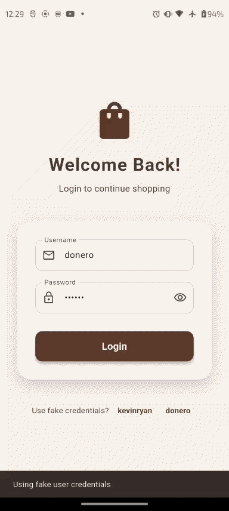

# Fake Store App

## How to start

- When app is launched there is a login screen. Fakestore api does not support creating new accounts. So instead we have to use existing account. Two of them given on the login screen.

- When app is logged we can see the product. Select category, search products and also add them to cart.

## Working Features
- User Authentication : Working
- Product Listing : Working
- Adding to Cart  : Working
- Selecting Categories : Working
- Searching Products : Working
- Changing Theme : Working

## Screenshots

  <table>
    <tr>
      <td></td>
      <td></td>
      <td></td>
    </tr>
    <tr>
      <td></td>
      <td></td>
      <td></td>
    </tr>
    <tr>
      <td></td>
      <td></td>
      <td></td>
    </tr>
  </table>

## Video

  

<!-- Or centered with caption
<figure align="center">
  
  <figcaption>Login to browsing products flow</figcaption>
</figure> -->